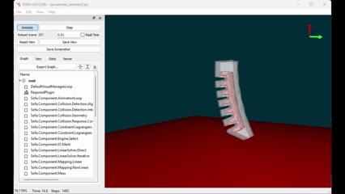

# Soft Robotics: RNN-Based Control of a Pneumatic Actuator in SOFA

This project explores **learning-based control for soft robots** using a recurrent neural network (RNN).  
A simple pneumatic actuator was modeled in the [SOFA Framework](https://www.sofa-framework.org/), and an **inverse model** was trained to directly control the actuator’s position.

---

## Demo

  

---

## Project Overview

- **Simulation Environment**: SOFA Framework was used to model a pneumatic actuator.  
- **Dataset Generation**:  
  - Random pressure inputs were applied across the actuator’s entire joint space.  
  - Resulting actuator states (positions, velocities) were recorded to build a training dataset.  
- **Model Training**:  
  - A **Recurrent Neural Network (RNN)** was trained as an **inverse dynamics model**.  
  - The RNN maps a desired position to the actuator’s required input pressure.  
- **Control**:  
  - The trained model allows direct position control of the actuator using keyboard input. 

---

## Repository Structure
  -data
    -training
    -test
    -mesh
  
